# README line-detection-robot

## Introduction

After completing all the steps in this documentation, you will have a Raspberry Pi robot that can follow a line using Computer Vision. The steps we are going to take are as follows. First, we write a program to detect the line using OpenCV, after that we can calculate the steering angle and steer accordingly.

If I did not go in-depth about a certain part of the code in the text, then you’ll probably find a brief explanation in the code itself.

The code used in this project can be found in this [GitHub repository](https://github.com/thibaultvt/line-detection-robot.git).

## 1 Chassis assembly and Raspberry Pi setup

### 1.1 Getting the right parts

First, we will build our Raspberry Pi Robot, the parts you need are listed below. It is possible to use another camera or robot chassis, you can also use a robot chassis with a servo motor to steer more accurate since the code to control the motor is in a separate module.

Make sure that you use a powerbank that works with the Raspberry Pi because not every powerbank does.

### Raspberry Pi Camera

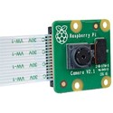

### L298N Motor driver module

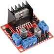

### Robot car kit 05 (Robot chassis for Raspberry Pi and Arduino)

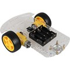

### Powerbank


### 4x AA Batteries

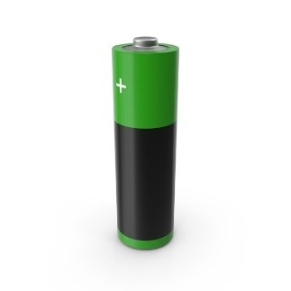

### 1.2 Assembly of the robot

I will not be discussing the assembly of the chassis itself since there are numerous videos with a clear explanation. [This is one of them.](www.youtube.com/watch?v=3a-bE1VlaU8)

For the rest of the assembly, you can use the scheme below, feel free to use other GPIO pins than me. The Raspberry Pi camera should be plugged in the connector circled with red. Make sure the blue side of the cable is facing in the direction of the arrow.

You should put as much weight as possible on the side of the driving wheels, otherwise the robot tends to start spinning. How you put everything together is fully up to you. 


### 1.3 Raspberry Pi setup

The only things we need to install on our Raspberry Pi are OpenCV and NumPy, which comes with OpenCV. Install all the dependent libraries of OpenCV and OpenCV itself using the commands below.

### 1.3.1 Installing what’s necessary

All dependent libraries of OpenCV:
```sh
sudo apt-get install libhdf5-dev -y && sudo apt-get install libhdf5-serial-dev -y && sudo apt-get install libatlas-base-dev -y && sudo apt-get install libjasper-dev -y && sudo apt-get install libqtgui4 -y && sudo apt-get install libqt4-test -y
```

OpenCV and NumPy:
```sh
pip3 install opencv-python
```

### 1.3.2 Enabling the camera

To enable the camera, follow these steps on your Raspberry Pi.
```sh
sudo raspi-config
```

Click on Interfacing Options

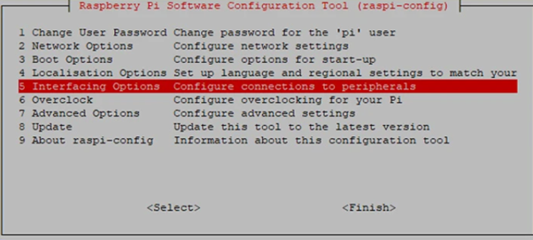

And finally, enable your camera

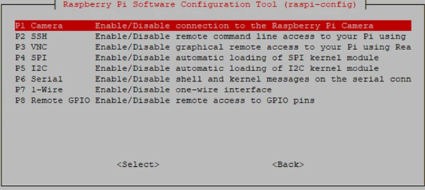

You can try to make an image or a video using the following commands. You can specify another video length by changing the parameter after ‘-t’. To flip your image or videoframes use vertical flip ‘-vf’ or horizontal flip ‘-hf’.

```sh
raspistill -o image.jpg
raspivid -o video.h264 -t 10000
```

## 2 Line detection using OpenCV

In this section we will be writing the python code to detect lines on an image and to determine the steering angle. The image below shows us the resulting frame, with the red line being the steering angle and the green rectangle visualizing the extremes of the detected line.

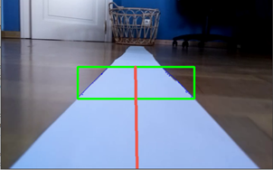

### 2.1 Getting ourselves an image

Before we can detect a line, we need an image with a line on it of course. We can achieve this by using the ‘raspistill -o image.jpg’ command and then transferring the image to our computer using WinSCP or something similar. 

As a line I used double folded paper, but you can use whatever you want as long as the whole line has the same colour. Make sure that the colour of your line is unique within the frame. 

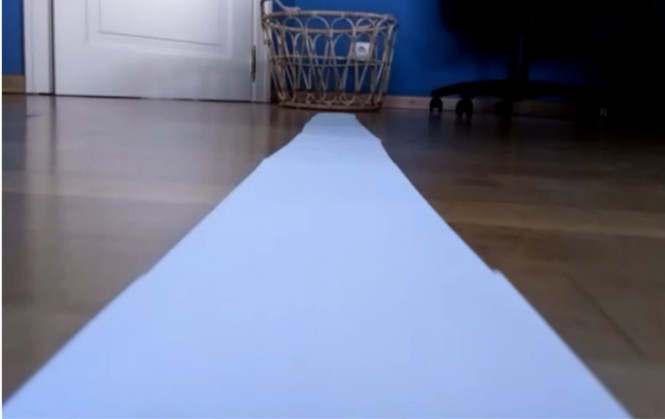

### 2.2	The beginning of our coding journey

Open your favourite editor and follow the steps in this section to create the line detection module.

### 2.2.1 Reading and showing images

OpenCV is a good library for Computer Vision, we can use it to read, modify and show images. To read and show the image use the code below.

```py
import cv2 as cv2
import numpy as np

#   Read the image
#   cv2.imread returns a three-dimensional array which 
#   represents our BGR image.
frame = cv2.imread('./line.png')

#   Show the image with a certain title
cv2.imshow("Frame we just read", frame)

#   Enables us to use 'q' to quit
cv2.waitKey(0)
#   Destroys all the windows we created
cv2.destroyAllWindows()
```

### 2.2.2 Isolating the line

To isolate the line, we first convert our image from BGR to HSV or Hue Saturation Value. HSV separates the image’s luminance from the colour information. This results in the line being the same colour everywhere on the frame regardless of its shading.

```py
hsv = cv2.cvtColor(frame, cv2.COLOR_BGR2HSV)
cv2.imshow("Converted to HSV", hsv)
```


On the HSV frame we can now isolate our line using the OpenCV inRange() function. Our colour needs to be in between the lower and upper HSV values.

```py
#   Specify the min and max HSV values 
lower_white = np.array([101, 66, 151])
upper_white = np.array([136, 255, 255])

#   Isolate the colour of the line on the frame
thresholdedFrame = cv2.inRange(hsv, lower_white, upper_white)
```


You can find the right hue values for your line on the image below or by using the python program underneath. The hue range in OpenCV can vary from 0 to 179. When using the hsvRangeFinder.py program, the only thing you need to do is change the image path, experiment with the sliders, find the appropriate HSV values and use them in your program.

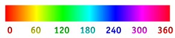


### 2.2.3 ROI or region of interest

We do not want our robot looking to far ahead, that’s why we are only going to detect the line on a certain piece of the frame. I chose my ROI to be 75 pixels down from the middle of the frame based on the position of my camera. You should pick a ROI where the line is not too wide, and where the robot can look just far enough ahead.

Setting our region of interest can be achieved by using the function below.

```py
def regionOfInterest(frame, nPixels):
    height, width = frame.shape

    #   Creates an all black frame with the same size as the given frame
    mask = np.zeros_like(frame)

    #   Specify four points to "draw" a rectangle over the nPixels top of the bottom half of the screen
    polygon = np.array([[
        (0, height * 1 / 2),
        (width, height * 1 / 2),
        (width, (height * 1 / 2) + nPixels),
        (0, (height * 1 / 2) + nPixels),
    ]], np.int32)

    #   Fill the created polygon(rectangle) with white
    cv2.fillPoly(mask, polygon, 255)

    #   Returns only the white part of the mask on the frame
    croppedFrame = cv2.bitwise_and(frame, mask)

    return croppedFrame
```
Next, use the function in the program and show the cropped frame.

```py
croppedFrame = regionOfInterest(thresholdedFrame, 75)
cv2.imshow("Cropped frame", croppedFrame)
```
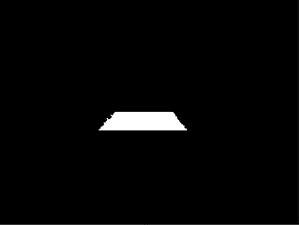

### 2.2.4 Finding the contours of the line

The way we detect our line we first need to find the contours of the line using the findContours() function from the OpenCV library. The function returns a Python list of all the contours in the image and every contour in the list is a NumPy array representing the (x,y) coordinates of the boundary points.

```py
#   findContours finds contours in a binary image
    contours, _ = cv2.findContours(
        croppedFrame, cv2.RETR_TREE, cv2.CHAIN_APPROX_SIMPLE)
```

This is what the found contours look like on the original frame.

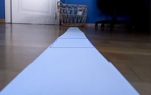

### 2.2.5 Drawing the contours on our frame
To draw the contours on the original frame, use the following function.

```py
def contourDraw(contours, frame, color=(255, 0, 0)):
    for i in range(len(contours)):
        cv2.drawContours(frame, contours, i, color, 1, 8)
```

### 2.2.6 Finding the shape of our object

Notice that our detected line is not a perfect rectangle, even when using cv2.CHAIN.APPROX.SIMPLE we still get more than four boundary points. If our line were a perfect rectangle then we would only have four boundary points like the image below, but since that is not the case, we will have to find the four most extreme points using another method. This is where convex hull comes into place.

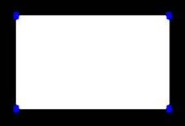

Kushashwa Ravi Shrimali explains Convex Hull as follows, “A Convex object is one with no interior angles greater than 180 degrees. A shape that is not convex is called Non-Convex or Concave. The Convex Hull of a concave shape is a convex boundary that most tightly encloses it”.

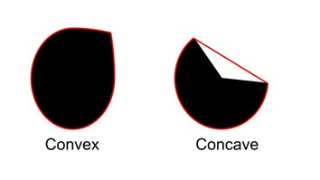

For a more in-depth explanation about Convex Hull check out [this article](https://learnopencv.com/convex-hull-using-opencv-in-python-and-c/).
Our detected line is not a convex but a concave, we can find the exterior shape of the object or hull using the OpenCV convexHull() function.

```py
def getHullArray(contours):
    #   A Convex object is one with no interior angles greater than 180 degrees.
    #   Hull means the exterior or the shape of the object.
    hull = []
    #   Calculate points for each contour
    for i in range(len(contours)):
        #   Creating convex hull object for each contour
        hull.append(cv2.convexHull(contours[i], False))

    return hull
```

After drawing the return value of the getHullArray() function on our original frame this is what we get, a plane with no interior angles greater than 180 degrees. Using the convexHull is not necessary in this project but if you want to show the detected line, then this is a much smoother way to do it than just drawing the contours.


If you want to draw the array of hull coordinates yourself, you can use the contourDraw() function from the previous section but instead of contours use the return value of getHullArray().

### 2.2.7 Finding the most extreme points

We cannot determine the steering angle from the array of coordinates that we have at the moment, or atleast not in a  clear way. That’s why we need to find the two most extreme points in the coordinates array. 

First, I give every point in the extremesList[] value zero in case we don’t detect a lane. Then I create a separate list for the X and Y coordinates and search for the minimum and maximum value of each list. With the four values we’ve found we can now draw a perfect rectangle over our line and determine the steering angle.

```py
def findExtremes(hull, frame):
    hullLength = len(hull)
    Xlist = []
    Ylist = []

    extremesList = [0, 0, 0, 0]

    for counter in range(hullLength-0):
        #   Create a separate list for X and Y coordinates
        for i in hull[counter]:
            Xlist.append(i[0][0])
            Ylist.append(i[0][1])

    #   We use this if statement to not get the max of an empty list
    if Xlist:
        extremesList[0] = min(Xlist)  # Xleft
        extremesList[1] = max(Xlist)  # Xright
        extremesList[2] = min(Ylist)  # Ytop
        extremesList[3] = max(Ylist)  # Ybottom

    return extremesList
```

### 2.2.8 Drawing the perfect rectangle
This part is not a necessary step either, but it looks cool in case you show your frame, so why not?

First, we need to get the X and Y coordinates out of the list. Secondly, we draw the rectangle on our original frame. Notice that I check whether the Ybottom value is equal to zero, this is done to prevent the rectangle from being drawn when no line is detected.

 ```py
 def drawExtremeRectangle(extremesList, frame):
    Xleft, Ytop, Xright, Ybottom = extremesList[0], extremesList[2], extremesList[1], extremesList[3]
    #   Don't draw the rectangle if Ybottom = 0, because it can never be 0 unless we set it to 0
    if Ybottom != 0:
        cv2.rectangle(frame, (Xleft, Ytop), (Xright, Ybottom), (0, 255, 0), 3)
```

### 2.2.9 Calculating the steering angle

Finally, the most important step to get our robot driving in the right direction, the steering angle.

The function getSteeringAngle() will return a steering angle between 0 and 180, which we will use to control the duty cycle of our PWM signals later on. To briefly explain what this function does, it calculates the center points in between the two extreme x coordinates and converts it to a value between 0 and 180 afterwards.

```py
def getSteeringAngle(extremesList, frame):
    Xleft, Xright, Ybottom = extremesList[0], extremesList[1], extremesList[3]
    _, width, _ = frame.shape
    steeringAngle = 90  # Default value is 90 => "Go straight"

    #   Don't calculate new steeringAngle if Ybottom = 0, because it can never be 0 unless we set it to 0
    if Ybottom != 0:
        centerCoord = round((Xright - Xleft) * 1/2)
        steeringCoord = Xleft + centerCoord
        #   Convert center of line coordinate to an angle between 0 and 180
        steeringAngle = round((steeringCoord / width) * 180)

    return steeringAngle
```

### 2.2.10 Drawing the steering line

This step is also not necessary, but once again it looks smooth if you want to show the frame.

The drawSteeringPoint() function draws a line from the center of the bottom of the frame to the vertical center and the calculated center of the line.

```py
def drawSteeringPoint(steeringAngle, frame):
    _, width, _ = frame.shape
    steeringCoord = round((width * steeringAngle) / 180)
    height, width, _ = frame.shape
    cv2.line(frame, (steeringCoord, round(height * 1/2)),
             (round(width * 1/2), height), (78, 89, 237), 5)
```

### 2.3 Reading video frames

First, we need a video, you can create one executing the ‘raspistill’ command and start pushing the robot over the line afterwards. The program we just wrote can also be used to detect lines on a video feed because, a video basically is a sequence of frames or images. 
I suggest you make a separate module for the lane detection and import it in your main python file like I did. We now read each frame of the video capture instead of only one image.

```py
import cv2 as cv2
import laneDetectionModule as ld
import time

videoPath = './resources/lineVideo.h264' 
cap = cap = cv2.VideoCapture(videoPath)

while(True):
    ret, frame = cap.read()

     #   Flips frames horizontally and vertically, 
     #   only needed if your video is upside down!
    frame = cv2.flip(frame, -1)

    #   Use all the necessary functions in the right order to detect the line on each frame
    thresholdFrame = ld.getThresholdedFrame(frame)
    croppedFrame = ld.regionOfInterest(thresholdFrame, 75)
    
    contours = ld.getContours(croppedFrame)
    hull = ld.getHullArray(contours)
    extremesList = ld.findExtremes(hull, frame)

    steeringAngle = ld.getSteeringAngle(extremesList, frame)

    #   Draws the contour, perfect rectangle and steering line
    ld.contourDraw(hull, frame, color=(255, 0, 0))
    ld.drawExtremeRectangle(extremesList, frame)
    ld.drawSteeringPoint(steeringAngle, frame)

    #   Display the edited frame
    cv2.imshow("Lane detection", frame)
    if cv2.waitKey(1) & 0xFF == ord('q'):
        break

    #   You only need this if the video plays too fast
    time.sleep(0.025)
#   When everything is done, release the capture
cap.release()
cv2.destroyAllWindows()
```

## 3 Controlling the motors

The biggest disadvantage of our setup is that we can only steer by changing the speed of our two wheels.

### 3.1 The theory behind controlling the motors

Before we dive into the code let's talk a little more about how the motors are actually controlled. The component that is responsible for controlling the motors is the L298N dual H-bridge driver.

The H-bridge enables us to change the motors' direction of rotation. Depending on which switch is closed in the schema below, the motor will rotate in a specific direction or not move at all. We only use one combination of open and closed switches because we want our robot to only move forward or backwards.

To change the speed of each motor we alter the PWM signal's duty cycle. PWM stands for Pulse with modulation, it enables us to lower the average power delivered by an electrical signal. It does this by turning a switch on and off at a very fast rate. The faster the switch is opened and closed, the faster our motors will rotate. To change the speed with which the switch is opened and closed, we change the duty cycle of our signal.

Wikipedia explains a duty cycle as follows,
> "A duty cycle or power cycle is the fraction of one period in which a signal or system is active."


### 3.2 Code to control the motors

So now that you know we control DC motors, we can write the code for it.

First, we setup all the pins to be able to control the motors.

```py
import RPi.GPIO as GPIO          
from time import sleep

#   Assign the appropriate GPIO pins, yours might be different!
GPIO.setmode(GPIO.BCM)
in1 = 23
in2 = 24
in3 = 22
in4 = 27
en1 = 25
en2 = 17

GPIO.setmode(GPIO.BCM)

#   Declaring first motor as output
GPIO.setup(in1,GPIO.OUT)
GPIO.setup(in2,GPIO.OUT)

#   Declaring second motor as output
GPIO.setup(in3,GPIO.OUT)
GPIO.setup(in4,GPIO.OUT)

#   Declares each motors' enable pin as output
GPIO.setup(en1,GPIO.OUT)
GPIO.setup(en2,GPIO.OUT)

#   Sets the PWMs' appropriate channel and frequency, PWM(channel, frequency)
p1=GPIO.PWM(en1,1000)
p2=GPIO.PWM(en2,1000)

#   Puts the robot in "forward"
GPIO.output(in1,GPIO.HIGH)
GPIO.output(in2,GPIO.LOW)
GPIO.output(in3,GPIO.HIGH)
GPIO.output(in4,GPIO.LOW)

#   Start the PWM with a duty cycle of 0 (stand still)
p1.start(0)
p2.start(0)
```

After that we write a function that uses the steering angle parameter to steer accordingly. How accurate your robot can steer is fully up to you. I chose to only implement one turning speed, but you could take the previous steering angle into account or have multiple turning speeds based on the steering angle’s value if you want to.

I suggest playing around with the constant and steer value until you find the perfect fit for your track.

```py
def steeringWheel(steeringAngle):
    steer = 90
    constant = 70
    if 0 <= steeringAngle <= 85:
        p1.ChangeDutyCycle(constant)
        p2.ChangeDutyCycle(steer)
        print('going left')
    elif 95 <= steeringAngle <= 180:
        p1.ChangeDutyCycle(steer)
        p2.ChangeDutyCycle(constant)
        print('going right')
    else:
        print('going straight')
        p1.ChangeDutyCycle(constant)
        p2.ChangeDutyCycle(constant)
```

You can find the code used to control the motors under motorModule in my GitHub repository.

## 4 Bringing everything together

We can now detect lines on an image or on video frames and steer accordingly, the next step is detecting the lines on the live camera feed we get from the Pi camera.

We can do this by using the picamera library.
```py
from picamera.array import PiRGBArray
from picamera import PiCamera
import time
```

After that we need to set up our Pi camera.

```py
camera = PiCamera()
camera.resolution = (640, 480)
camera.framerate = 32
rawCapture = PiRGBArray(camera, size=(640, 480))

#   Give the camera some time
time.sleep(0.1)
```

And then we keep on iterating over the frames gathered by the capture_continuous() function.

```py
for frame in camera.capture_continuous(rawCapture, format="bgr", use_video_port=True):
    #   Converts frame to NumPy array
    frame = frame.array

    rawCapture.truncate(0)
    if cv2.waitKey(1) & 0xFF == ord('q'):
        break
```

The rest of the code you can find in the GitHub repository in the mainOnPi file. Next, transfer motorModule, mainOnPi and the laneDetectionModule to your Raspberry Pi, put your Raspberry Pi on the line and run the following command.

```sh
python3 mainOnPi.py
```
